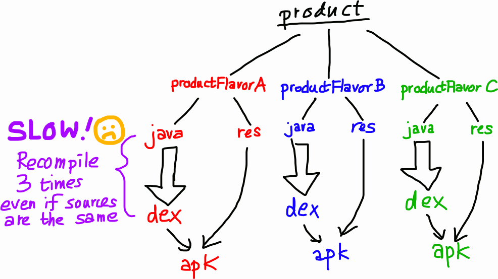
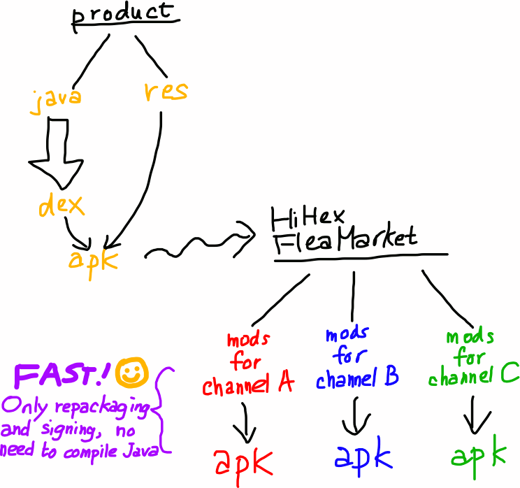

HiHex FleaMarket
================

[](https://travis-ci.org/hihex/fleamarket)
[](https://coveralls.io/github/hihex/fleamarket?branch=master)

**HiHex FleaMarket** is a Gradle Plugin to quickly generate multiple APKs which share the same code, have have different resources or signatures. It is ideal for distributing APKs to multiple Android markets with analytics distinction or customized skins.

HiHex FleaMarket is basically a wrapper around the [`aapt`](http://elinux.org/Android_aapt) tool, and provides seamless integration into the Gradle build system.

Why
---

The Gradle Plugin for Android provides "[productFlavor](http://tools.android.com/tech-docs/new-build-system/build-system-concepts#TOC-Product-Flavors)" to create multiple variants of some application. However, productFlavor allows different source code to be used, so this option is extremely slow due to multiple recompilations



Instead of branching off early, HiHex FleaMarket modifies the assembled APK, replacing resources and manifests to form new APKs. This makes the process much faster.



Set up
------

* HiHex FleaMarket uses Gradle 2.6+ and Android Plugin for Gradle 1.3.0+.

Add the plugin to the beginning of the `build.gradle` of the application module:

```gradle
plugins {
    id 'hihex.fleamarket' version '0.2.0'
}
apply plugin: 'com.android.application'
...
```

Defining channels
-----------------

The configurations that lead to different APKs are called "channels". These configurations are declared in the `channels` block:

```gradle
channels {
    defaultConfig {
        filename { "${it.name}-v${VERSION_NAME}.apk" }
        manifest { c -> analyticsChannel = c.name }
    }
    create 'google', 'amazon', 'getjar', 'slideme', 'fdroid', 'samsung'
    create('baidu') {
        resources file('src/customized/baidu/res')
    }
}
```

| Statement             | Description                                                                                                   |
|-----------------------|---------------------------------------------------------------------------------------------------------------|
| `defaultConfig { … }` | Provides the default configuration shared by all channels. Must present at the top of the `channels` block.   |
| `create 'A', 'B', …`  | Declares multiple channels, which shares the same configuration as the defaultConfig.                         |
| `create('A') { … }`   | Declares a channel, and provide further customization based on the defaultConfig.                             |

All non-code resources may be customized, but currently HiHex FleaMarket supports the following modifications in each configuration:

```gradle
defaultConfig {
    filename { Channel c ->
        "${c.name}.apk"
    }
    signingConfig android.signingConfig.release
    buildType 'release'
    flavors 'armv7', 'paidapp'
    manifest { Channel c ->
        analyticsChannel = c.name
    }
    values {
        replaceStrings ~/MyOldBrand/, 'MyNewBrand'
    }
    asset 'www/index.html', file('src/customized/default/assets/www/index.html')
    resources file('src/customized/default/res')
}
```


| Method name       | Description                                                                               |
|-------------------|-------------------------------------------------------------------------------------------|
| `filename`        | Defines the filename of the APK generated by this channel. The input can be a **String** or a **[Channel](#Channel) → String** closure, so that the filename pattern may be defined directly in defaultConfig. |
| `signingConfig`   | The private key used to [sign the APK](https://developer.android.com/tools/publishing/app-signing.html). If not specified, this plugin will use the debug key to sign the APK. |
| `buildType`       | Which buildType the channel should modify from. Should be either `release` or `debug`.    |
| `flavors`         | The productFlavor the channel should modify from. Each channel should base on exactly one [build variant](http://tools.android.com/tech-docs/new-build-system/user-guide#TOC-Build-Variants) (buildType + productFlavor).
| `manifest`        | Defines a **[Document](https://docs.oracle.com/javase/8/docs/api/org/w3c/dom/Document.html).([Channel](#Channel)) → void)** closure to modify the AndroidManifest.xml file.    |
| `values`          | Defines a **[ResValue](#ResValue).([Channel](#Channel)) → void)** closure to modify all resource values (strings, colors, dimensions, integers, etc.) |
| `asset`           | Insert or replace a file to the assets folder.                                            |
| `resources`       | Replaces existing resources (drawables, layouts, xmls, etc.). The folder should have the same structure as normal res/ folders. |

Data types
----------

### Channel

```groovy
class Channel {
    String      name            // Name of the channel, i.e. the name in the create() method
    String[]    flavors         // List of productFlavors this channel is based on
    String      buildType       // The buildType this channel is based on
}
```

### ResValue

```groovy
class ResValue {
    String      qualifier       // Configuration qualifier, e.g. "en-rUS", "hdpi", etc. Nullable.
    Element     element         // Element that represents this resource value in the values.xml.
    String      type            // Tag name of the element, e.g. "string", "color", "dimen", etc.
    String      name            // Name of the resource.

    /// Perform regex replacement on all string resources (string, plurals, string-array).
    def replaceStrings(Pattern pattern, replacement)
}
```

### Convenient methods

This plugin provides some convenient extension methods to Document to perform some common operations on the AndroidManifest.xml:

```groovy
interface Document {
    /// Sets the value of XXXX_CHANNEL meta-data in the manifest. Covers most analytic SDKs that
    /// supports multiple channels.
    def setAnalyticsChannel(String channel)

    /// Delete all tags which have the given tag name and `android:name`.
    def deleteTagsWithName(String tagName, String name)

    /// Adds a <uses-permission> tag
    def addUsesPermission(String permissionName)

    /// Changes the android:name of all tags
    def renameTags(Pattern namePattern, replacement)
}
```

Tasks
-----

The FleaMarket plugin provides two tasks.

To generate an APK, run the **assemble<i>ChannelName</i>** task. The output APK can be found in <tt>build/outputs/flea-market/<i>channelName</i>.apk</tt>.

One may also list all channels using the **listChannels** task.

License
-------

HiHex FleaMarket is licensed in [GPL v3.0](http://www.gnu.org/licenses/gpl-3.0.en.html) or later.


Alternatives
------------

* If you only need to generate different APKs for different markets, without modifying AndroidManifest nor resources, you may try the [mulchannel plugin](https://github.com/ihrthk/android-gradle-mulchannel-plugin) from Meituan, which promises a speed of 0.1s/APK. This plugin injects files into the META-INF/ folder to skip the code signing steps. Needless to say, this method is much less flexible in customization (e.g. you cannot change the display name or icon), and requires special handling inside the code in the first place.


